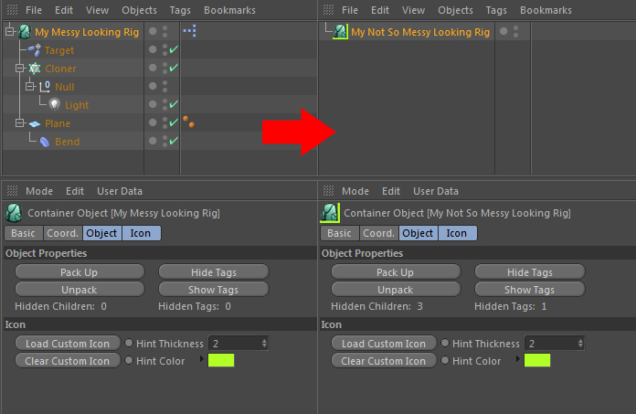

# Cinema 4D Container Object Plugin

This plugin for Cinema 4D extends MAXONs 3D application by a new object which
functions as a container for other objects. It is similar to Cinemas' built-in
*Null-Object*, but enables the user to hide its child-objects and tags. It
also allows to give it a custom-icon for more customization.

## Installation

Currently, the Windows build is included for the x86 and x64 architecture. The
Mac build of the current version was done by Michael Hantelmann. In the future,
I will hopefully be able to compile plugins for Mac myself.

After downloading this package from github, one may delete the following files
as they are not necessary to run the plugin, only to compile it.

- `src/*`
- `Makefile`
- `.gitignore`
- `.gitattributes`

## Custom Compilation

The included builds are built against the R14 API. If you want to compile the plugin
for another version of Cinema 4D, you can choose between either using the Visual
Studio IDE (Windows), the XCode IDE (Mac) or my custom makefile collection that can
be found [here][1] (currently, Windows only). I can not give support for the IDE's as
I'm not using any of them. Please check the [plugincafe][3] and ask there.

This is an example for how to build on Windows x86. The Visual C++ compiler
is the only compatible compiler at this time (May 2013).

    vcvarsall x86
    make plugin

To compile for 64-bit, this needs to be adjusted slighty. The makefile must be
told we're going to build for x64.

    vcvarsall x86_amd64
    make plugin C4D_ARCHITECTURE=x64

## Legal

The plugins' and the its source-code are licensed under the GNU Lesser General
Public License. The plugins' icon (`res/Ocontainer.png`) is obtained from
[findicons.com][2].

  [1]: https://github.com/NiklasRosenstein/c4d-make
  [2]: http://findicons.com/
  [3]: http://plugincafe.com/forum

